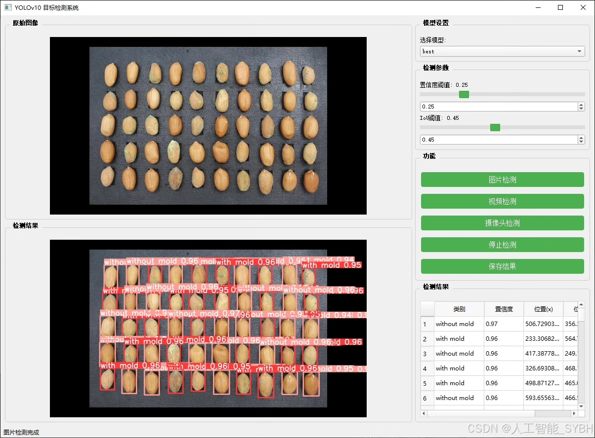
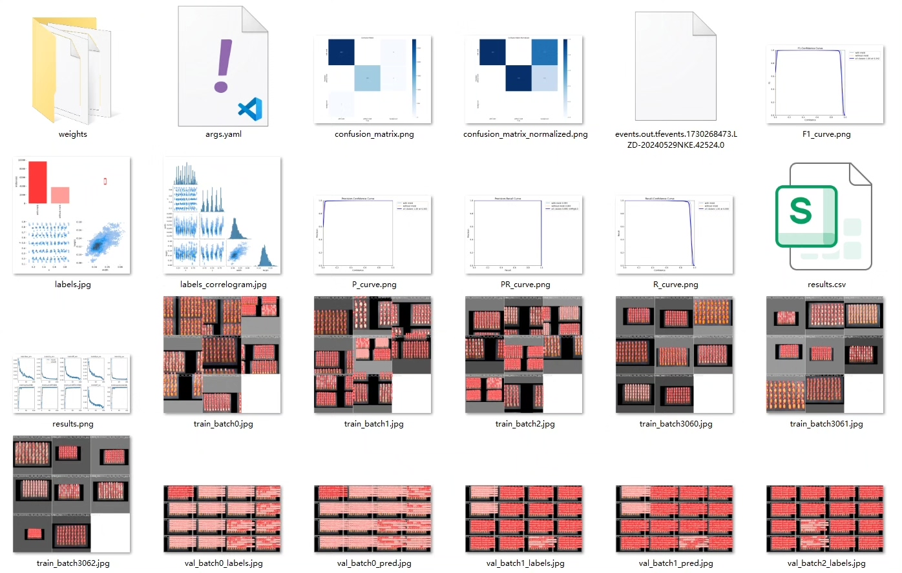
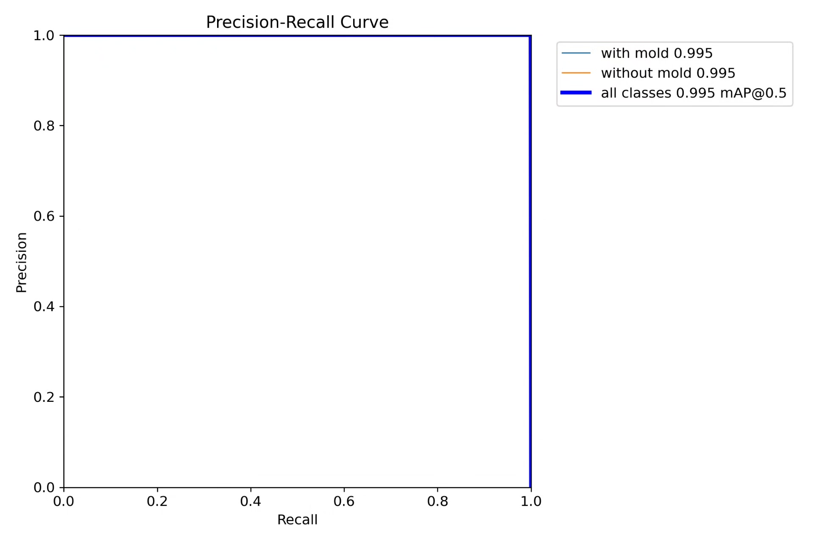
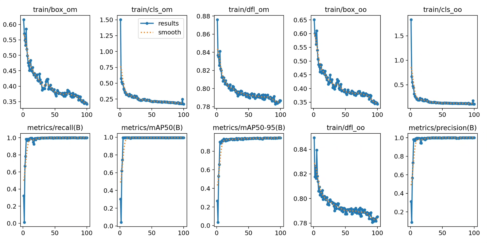
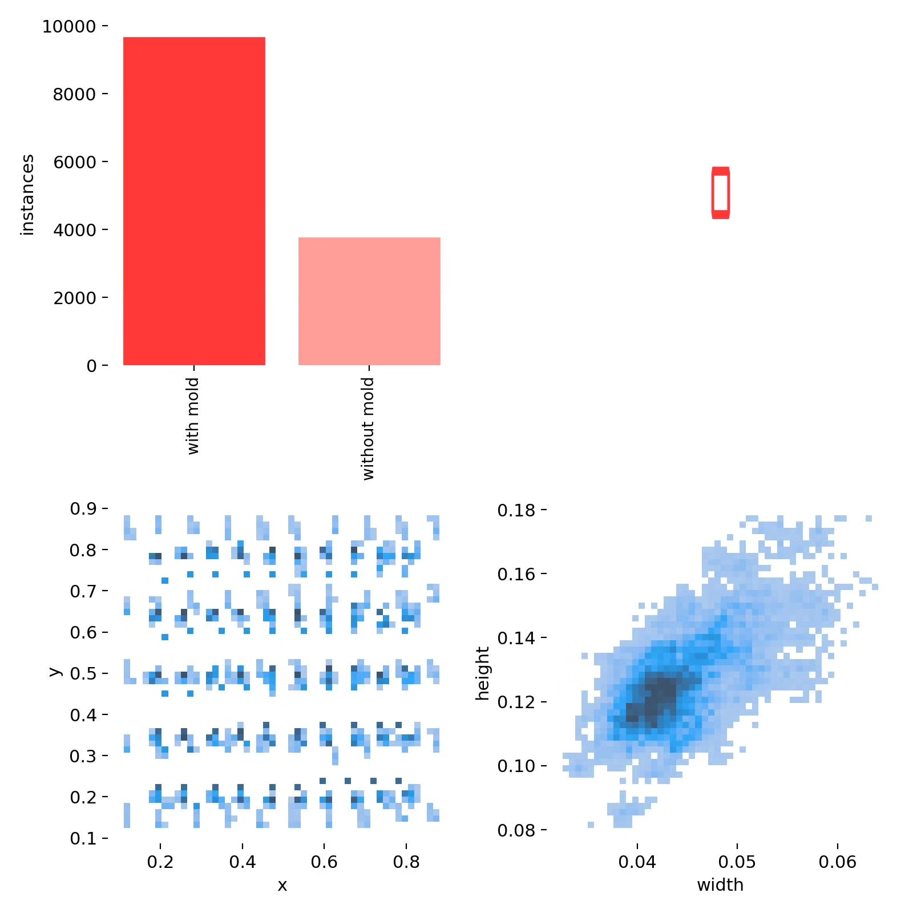
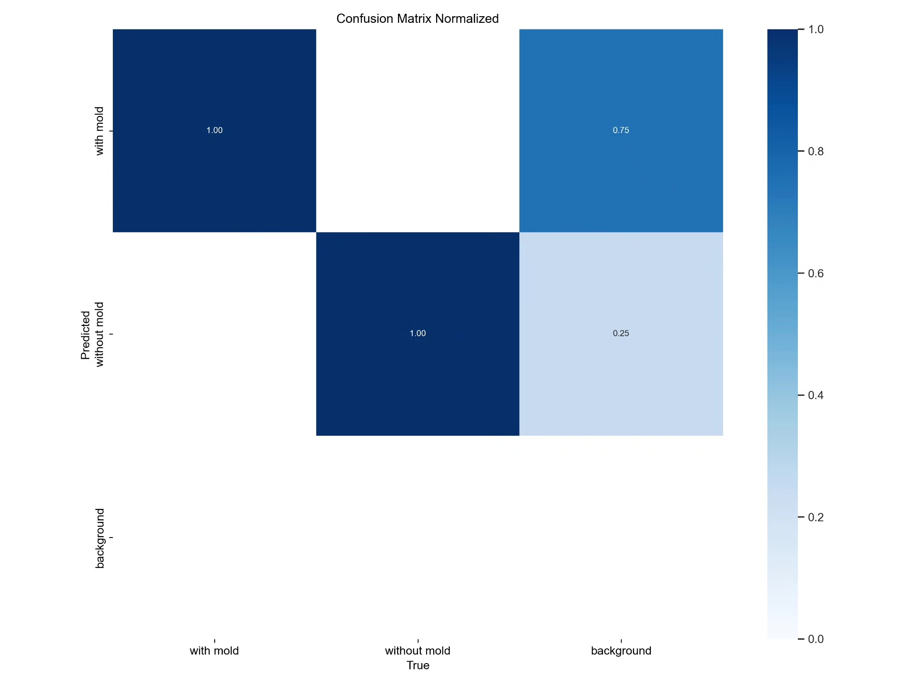
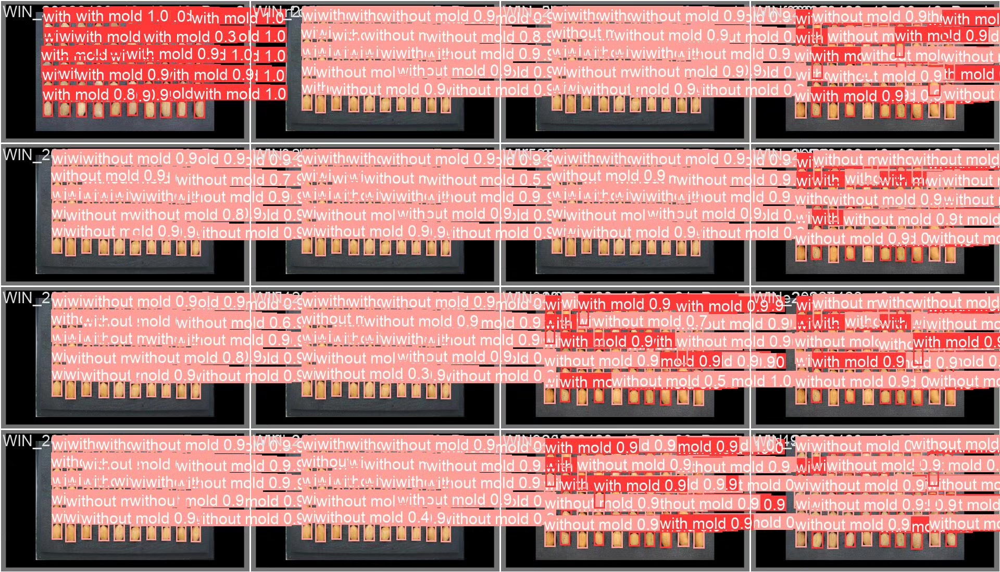
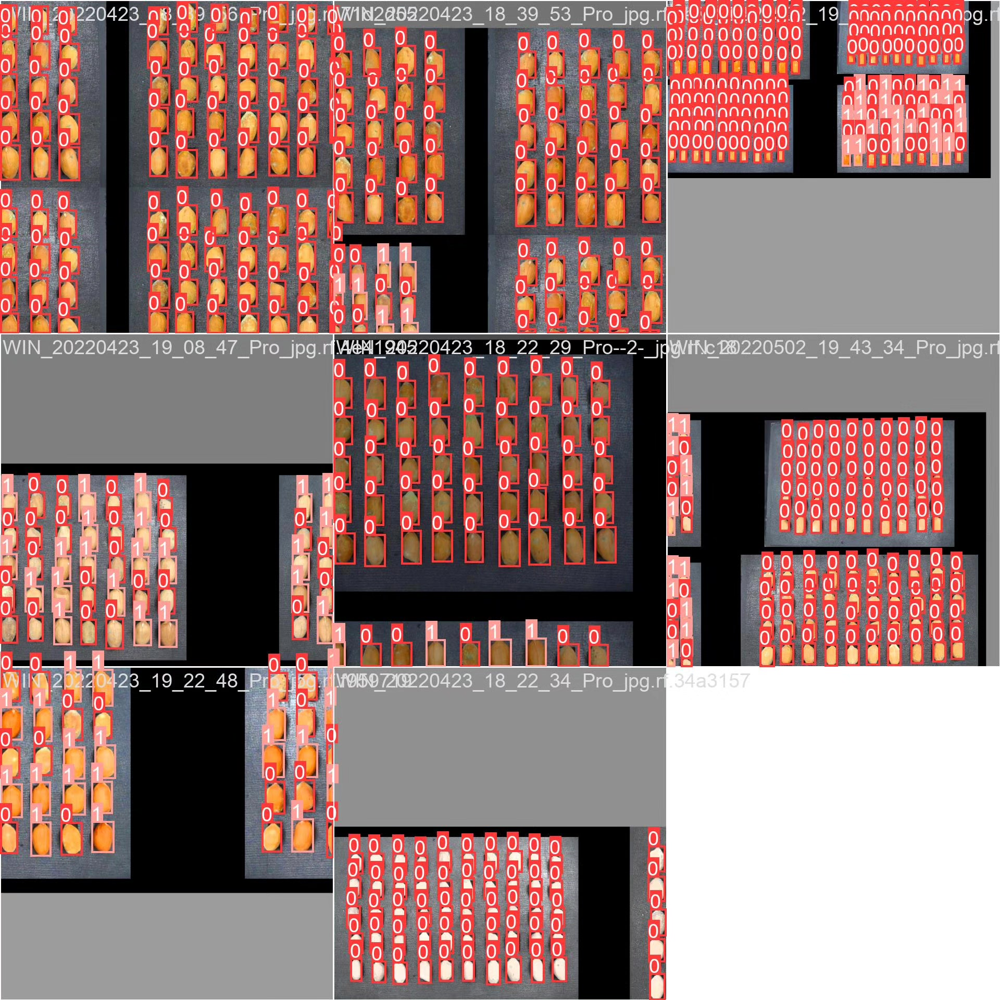

# Pear seed mold detection system based on YOLOv10 deep learning

## Body

Based on the YOLOv10 deep learning model, a peanut seed mold detection system (YOLOv10+YOLO dataset + UI interface + Python project source code + model) is developed.

This study utilizes the YOLOv10 model for peanut seed mold detection, aiming to achieve automated and efficient detection of peanut seed quality. Peanut seeds are prone to mold attack during storage, leading to mold formation, which affects their germination rate and food safety. Traditional detection methods rely on manual judgment, which is inefficient and subjective. Based on deep learning target detection technology, especially the YOLOv10 model, real-time detection can be achieved while ensuring high accuracy. This study constructs a peanut seed dataset with a large amount of labeled data, trains and optimizes the YOLOv10 model, and ultimately achieves a high detection accuracy of 99.5% on the test set, providing an efficient solution for peanut seed quality detection.

The company's products have obtained the official commercial license certification from YOLO.

We provide after-sales service.

After payment, we will provide WeChat ID for any questions.

Environment configuration: We will provide a tutorial on environment configuration, and WeChat will provide answers to questions.

Remote installation service: If you need remote configuration, an additional fee of 69 is required,
failure in configuration will result in all fees refunded (only refund installation fees for special old computers).

Retraining dataset: After setting up the environment, you can train on your own computer.
If you need us to retrain, just pay 69 plus computing power fees (2.5 yuan/hour).

Full after-sales service

## Images

## Payment

Here is a pay link on Stripe ( https://buy.stripe.com/3cs8yP7sY87d0vu9AB ). Please contact me lonlonago@foxmail.com after funding $89, and I will send you a complete data files , thank you!

